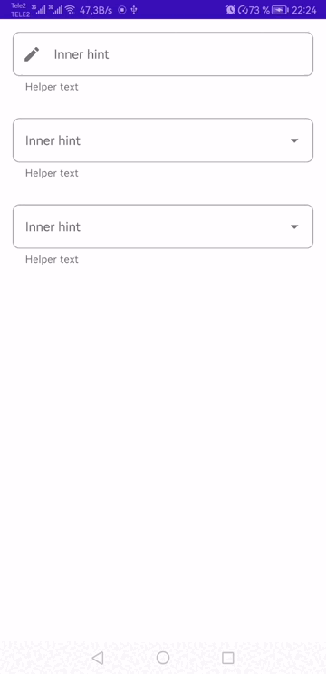

# Outline TextInputLayout with inner hint

Outline TextInputLayout with inner hint

# Preview



# How to use

Simple field
```
<com.alab.input_layout_inner_hint.TextInputLayout
        android:id="@+id/simpleTextInputLayout"
        style="@style/TextInputLayout"
        android:layout_width="match_parent"
        android:layout_height="wrap_content"
        android:hint="Inner hint"
        app:endIconMode="clear_text"
        app:helperText="Helper text">

        <com.google.android.material.textfield.TextInputEditText
            android:layout_width="match_parent"
            android:layout_height="wrap_content"
            android:background="@drawable/text_input_white_background_unfocused_shape"/>

    </com.alab.input_layout_inner_hint.TextInputLayout>
```

AutoComplete field
```
<com.alab.input_layout_inner_hint.TextInputLayout
        style="@style/TextInputLayoutDropdownMenu"
        android:layout_width="match_parent"
        android:layout_height="wrap_content"
        android:hint="Inner hint"
        app:helperText="Helper text">

        <com.google.android.material.textfield.MaterialAutoCompleteTextView
            android:id="@+id/materialAutoCompleteTextView"
            android:layout_width="match_parent"
            android:layout_height="wrap_content"
            android:background="@drawable/text_input_white_background_unfocused_shape"
            app:endIconMode="clear_text" />

    </com.alab.input_layout_inner_hint.TextInputLayout>
```

Selected field
```
<com.alab.input_layout_inner_hint.TextInputLayout
        style="@style/TextInputLayoutDropdownMenu"
        android:layout_width="match_parent"
        android:layout_height="wrap_content"
        android:hint="Inner hint"
        app:helperText="Helper text">

        <com.google.android.material.textfield.MaterialAutoCompleteTextView
            android:id="@+id/materialAutoCompleteTextViewSelector"
            android:layout_width="match_parent"
            android:layout_height="wrap_content"
            android:inputType="none"
            android:background="@drawable/text_input_white_background_unfocused_shape"
            app:endIconMode="clear_text" />

    </com.alab.input_layout_inner_hint.TextInputLayout>
```


# To get a Git project into your build:
Add it in your root build.gradle at the end of repositories
```
allprojects {
	repositories {
		...
		maven { url 'https://jitpack.io' }
	}
}
```
```
dependencies {
	implementation 'com.github.AndroidLab:input_layout_inner_hint:Tag'
}
```
